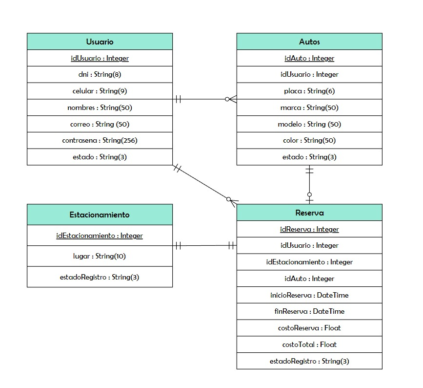
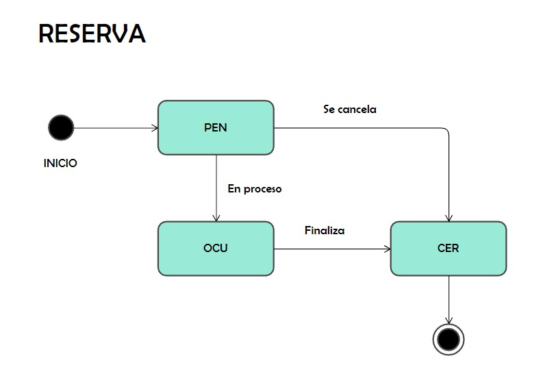
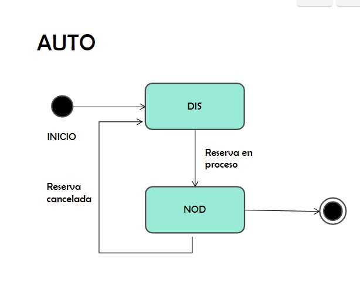
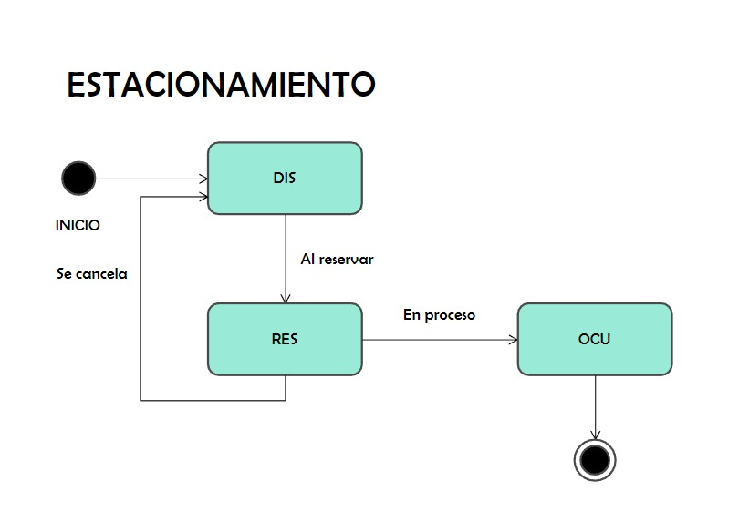

# Sistema de Reserva de Estacionamientos

## Integrantes
- Nicolás Diego Castañeda Quichís - 201910104
- Mariajulia Romina Romani Tafur  - 202110320
- Juaquin Estefano Remon Flores   - 202110302
- Virginia Norma Puente Jara      - 202110281

## Descripción del proyecto

El sistema de reserva de estacionamiento permite al usuario realizar reservas remotas en estacionamientos y verificar el estado de cada aparcamiento del establecimiento. Además permite a las empresas una gestión automatizada de su estacionamiento.

## Objetivos

- Implementar el uso de los framework Flask y Vue para así entender sus funcionalidades para la creación de un aplicativo web.
- Aprender sobre el desarrollo de un front-end a través de Javascript, HTML y CSS.
- Automatizar un sistema que permita a un usuario registrar una reserva en un estacionamiento remotamente.

## Modelo Relacional



## Gráfico de estados





## Frameworks/plugins/librerías/base de datos

### Frameworks
- Bootstrap: Framework de front-end que utiliza plantillas de diseño HTML y CSS usadas para la creación de páginas web.
- Flask: Framework back-end de Python utilizado para el desarrollo de aplicaciones web.
- Vue : Framework front-end utilizado para construir interfaces de usuario.
### Plugins
- Flask-SQLAlchemy: Extensión de Flask que añade la funcionalidad de SQLAlchemy en una aplicación web de Flask.
### Librerías
-  Jquery: Librería de Javascript que simplifica la interacción con HTML, manejo de eventos, CSS y Ajax.
- Werkzeug: Librería WSGI de aplicaciones web con variadas utilidades para su desarrollo.
### Base de datos
- PostgreSQL: Sistema de gestión de base de datos relacional de software libre.

## Inicializar base de datos

La aplicación utiliza una base de datos en Postgres, por lo cual tiene dos formas para hacerlo.

### Base de datos Local
Necesitará crear su base de datos de forma local, para ello puede seguir las siguientes instruciones.
1. Entrar a psql con usuario `postgres` e ingresar su contraseña, si es que tiene.
    ```
    psql -U postgres
    ```
2. Ejecutar el siguiente comando en psql para crear la base de datos `sre` que se utiliza en esta aplicación.
    ```
    CREATE DATABASE sre;
    ```
3. Para este modo, debe añadir una variable de entorno llamada `POST_PASS` para que la aplicación se conecte a la base de datos.
    ```{bash}
    export POST_PASS=mi_contraseña
    ```

### Base de datos personalizada
Si quisiera usar una base de datos alojada, en esta aplicación puede cambiar la URI en el modulo `base_de_dato.py`, exactamente en la linea 5.

## Endpoints

### get_usuarios
- /usuarios método : GET

Obtiene los usuarios registrados en nuestra base de datos.

### login
- /session método: POST

Recibe el correo y la contraseña del formulario register de manera automatizada. Para luego verificar que los datos ingresados coincidan con los datos existentes en la tabla Usuario. Se crea un token para garantizar que los datos sean válidos y seguros.

### token_required
- /session método: PATCH

Verifica si el inicio de sesión de un usuario se mantiene activa.


### create_usuario
- /usuario método: POST

Extrae información del contenido de un formulario de manera automatizada. Asimismo, informa al usuario si el contenido ingresado no cumple con los requisitos solicitado. Si la petición ha sido exitosa, redirigirá al usuario de maner automática a la página de login.

### get_estacionamiento
- /estacionamiento método: GET

Retornará todos los lugares de reserva existentes en la base de datos **Estacionamiento**.
### get_autos
/autos/<idUsuario> método : GET

Filtra por idUsuario los datos de los autos y los manda al frontend para mostrarlos de manera ordenada de acuerdo al idAuto.

### create_autos
- /autos/insert método: POST

Recibe un diccionario JSON con la información de placa, marca, modelo y color de un auto. Asimismo, halla el idUsuario del usuario que va insertar el auto. Verifica si la placa ya ha sido utilizada. Retorna un JSON con la descripción en caso se haya editado correctamente o el auto no es válido debido a la placa repetida.

### create_reserva

- /reserva método: POST

Recibe un diccionario JSON con la información necesaria para hacer una reserva, dentro de este puede incluir un nuevo diccionario JSON con la información necesario para añadir un auto si es que el usuario asi lo requiera.

### delete_auto
- /autos/delete/ método: POST

Recibe un diccionario JSON con la información idAuto de un auto. Retorna un JSON con la descripción en caso el auto se haya eliminado correctamente o haya sucesido algún error. 

### update_autos
- /autos/update/ método: POST

Recibe un diccionario JSON con la información de idAuto, marca, modelo y color de un auto. Los atributos que se pueden modificar son marca, modelo y color, ya que la placa es única para cada auto. El idAuto sirve para saber cual dato exactamente se va a modificar. Retorna un JSON con la descripción en caso se haya editado correctamente o haya sucedido algún error.

### get_reservas
- /reservas/<idUsuario> metodo: GET

Filtra por idUsuario los datos de las reservas para posteriormente ser mostrada de forma ordena en el frontend.

### delete_reservas
- /reservas/delete/ método: POST

Recibe un diccionario JSON con la información idReserva de una reserva. Retorna un JSON con la descripción en caso la reserva se haya eliminado correctamente o haya sucedido algún error.

---------------------------------------------------------------------------------------------------------------------------

## Forma de autenticación

### Registro
El programa utiliza un registro simple el cual recopila el dni, nombres, celular, correo y contraseña del usuario. El registro verifica que el dni, correo y celular sean únicos. Además, el programa solicita que la contraseña posea una minúscula, una mayúscula, un caracter especial, un dígito y tenga entre 5 a 20 caracteres en total.

### Inicio de sesión
El sistema solicita el correo y contraseña para iniciar una sesión en la aplicación web. Se verifica que los datos pertenezcan a la base de datos en cuyo caso se permite el acceso al sistema de reservas de estacionamientos. En caso contrario, se provee un mensaje de error.

## Manejo de errores

### 500 : Errores en el Servidor 

- 500 Internal Server Error: El servidor ha encontrado una situación que no sabe cómo manejarla. Se envía un mensaje informando de este error al usuario para luego redirigirlo a la página principal. Ocurre también cuando el usuario ingresa una placa con mayor tamaño permitido, se enviará un mensaje que informe al usuario de lo ocurrido.

- 503: El servidor no está listo para manejar la petición. Se envía mensaje informando al cliente que el servicio no se encuentra disponible. Por lo tanto, deberá intentarlo más tarde.

### 400 : Errores en el Cliente 

- 404: El servidor no pudo encontrar el contenido solicitado. Ante la ocurrencia de este error se le redirigirá a la página principal en un tiempo de 5 segundos o menos si el usuario da click en donde se solicita.

- 405: El servidor web está configurado de una forma que no permite que usted pueda llevar a cabo una acción para un URL en particular. Por lo tanto, va a ser redirigido a la página principal.

### 300 : Redirección 

- 304: Le indica al cliente que la respuesta no ha sido modificada.

### 200 : Exitoso

- 200:  La solicitud ha tenido éxito. Se muestra un mensaje indicando que la solicitud fue recibida y procesada de manera satisfactoria. 

- 201: La petición se ha procesado y como resultado se ha creado un nuevo recurso. Este mensaje se da cuando un usuario se registra o intenta modificar o añadir nueva información a la tabla de autos o reservas pertenecientes a él mismo.

### 100 : Informacional 

- 100: Esta respuesta provisional indica que el cliente debe continuar con la solicitud o ignorarla si ya está terminada. 


## Ejecución del sistema

### Requisitos
- Python >= 3.8
- Postgres >= 12

### Preparar dependencias
Al ser esta aplicación desarrollado en Flask, vamos a utilizar varias dependencias que estan señaladas en el archivo `requirements.txt`. Las puede instalar con el siguiente comando:
``` {bash}
pip3 install -r requirements.txt
```
### Ejecutar
Para ejecutar la aplicación, se debe ejecutar el siguiente comando:
```{bash}
python3 app.py
```
